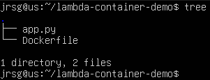
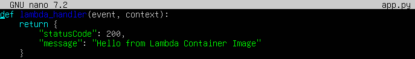
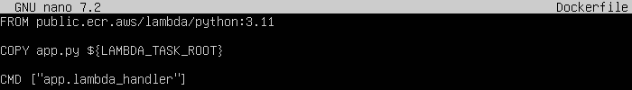
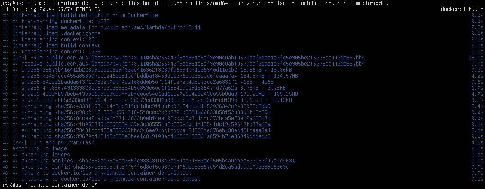
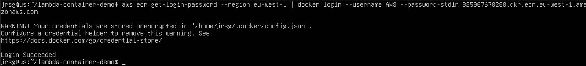
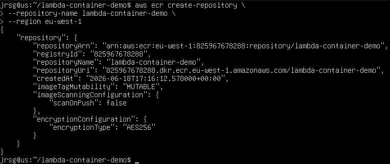
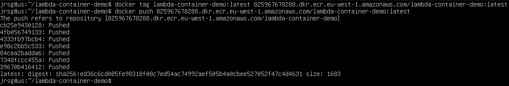
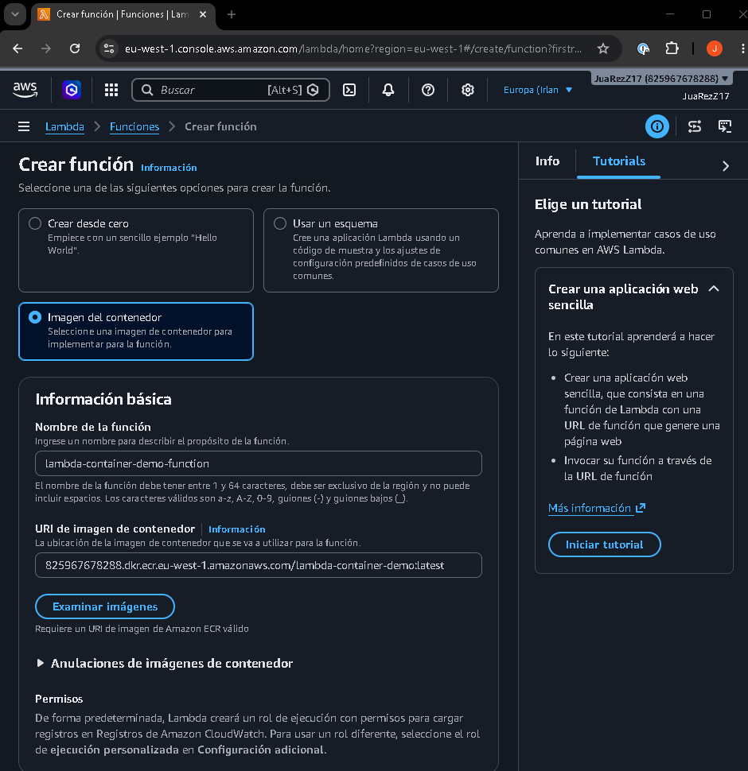
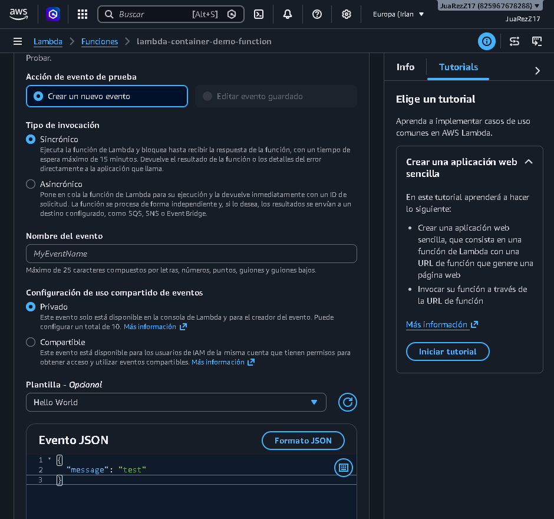
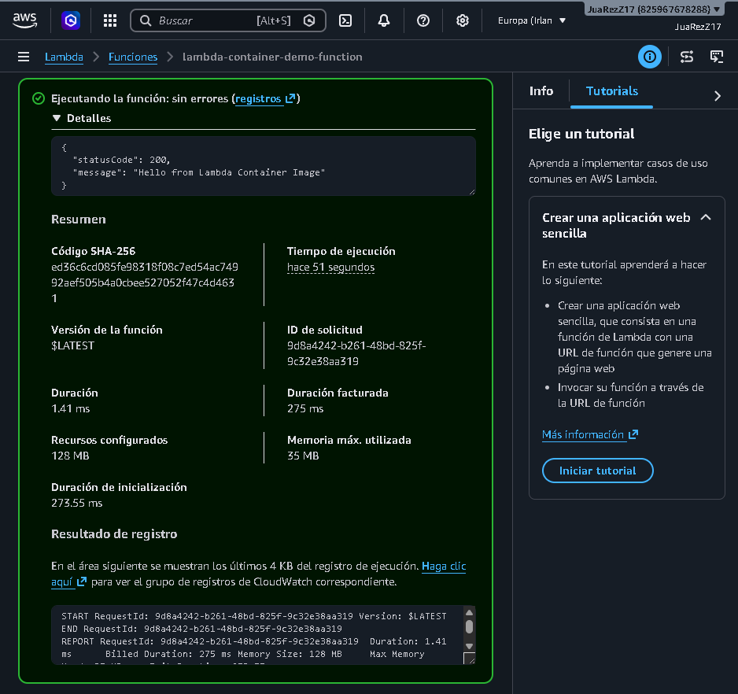

# Modern Serverless Computing with Containers

## Objective
To merge the worlds of modern application development (DAM) and containerisation (Docker) within the AWS Serverless Cloud paradigm, thereby eliminating server management entirely.

### Lambda Container Images
Lambda Container Images allow you to run AWS Lambda functions using Docker images instead of traditional ZIP packages. This offers much greater flexibility, particularly when a function requires numerous dependencies, large libraries or a custom runtime environment.

One of its main advantages is that images can be up to 10 GB in size, which far exceeds the usual limitations of ZIP files. Furthermore, these images must comply with the OCI specification, ensuring they adhere to a standard compatible with the container ecosystem.

Typically, the process involves creating the image with Docker, uploading it to Amazon ECR and then configuring Lambda to use it. Even when working with containers, Lambda retains its serverless philosophy, so there is no need to manage servers or worry about scaling.

In short, this functionality is very useful for more complex projects, as it combines the convenience of Docker with the advantages of AWS Lambda, such as on-demand execution, automatic scaling and pay-as-you-go billing.

### Event-Driven Architectures
Event-driven architectures are based on services reacting automatically when something happens within the system. Rather than having servers running all the time, functions are triggered only when they receive a specific event.

On AWS, this can be achieved using services such as EventBridge or SQS. EventBridge allows events to be received, filtered and routed to the appropriate service according to defined rules. For example, it can trigger a Lambda function when a specific action occurs in an application or another AWS service.

SQS, on the other hand, functions as a message queue. An application can send tasks to this queue, and Lambda handles processing them when messages become available. This helps to decouple the system’s components and prevents one part from depending directly on another.

This type of architecture is highly efficient because resources are only utilised when there is actually work to be done. Furthermore, it enables the creation of more scalable, resilient and cost-effective systems, capable of adapting better to peak loads or changes in demand.

### Exercise 1: Write a minimalist Python app. Create a Dockerfile based on the official AWS Lambda image for Python (public.ecr.aws/lambda/python:3.11).
We create the directory and file structure:

- **`def lambda_handler(event, context):`:** This is the function that AWS Lambda will execute. The name `lambda_handler` must match what we specify later in the Dockerfile.

- **`event`:** Contains the data that Lambda receives when it is invoked.

- **`context`:** Contains execution information, such as remaining time, function name, memory, etc.

- **`return { \ ‘statusCode’: 200, \ “message”: ‘Hello from Lambda Container Image’ \ }`:** Returns a simple response to verify that the function is working correctly.

- **`FROM public.ecr.aws/lambda/python:3.11`:** Uses the official AWS Lambda image for Python 3.11.

- **`COPY app.py ${LAMBDA_TASK_ROOT}`:** Copies the app.py file into the directory where Lambda expects to find the code.

- **`CMD [‘app.lambda_handler’]`:** Specifies which function Lambda should run. `app` refers to the app.py file and `lambda_handler` is the Python function.

### Exercise 2: Build the image using Docker and upload it to a private repository on AWS ECR (Elastic Container Registry) via the CLI.
We build the image:

We log in to AWS:

We create the private repository on AWS:

We tag the image for ECR and push it:

### Exercise 3: Create an AWS Lambda function, selecting the image you have just uploaded to ECR as the code source. Run a test invocation from the console and check the execution speed.
Log in to your AWS account > Lambda > Functions > Create function:

Once the function has been created, go to the ‘Test’ tab and create a test event using the following JSON:

We test the event:

