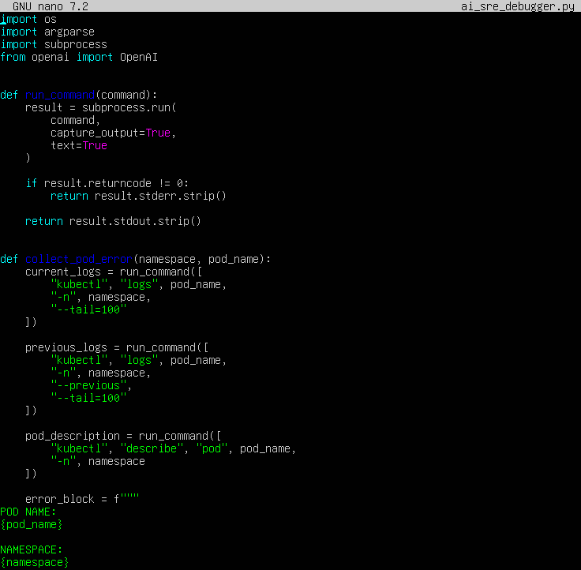
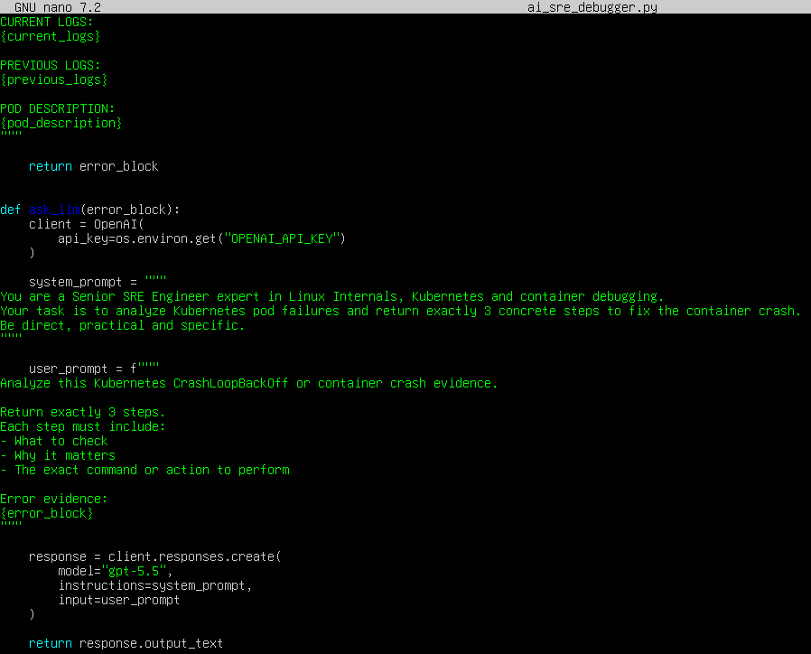
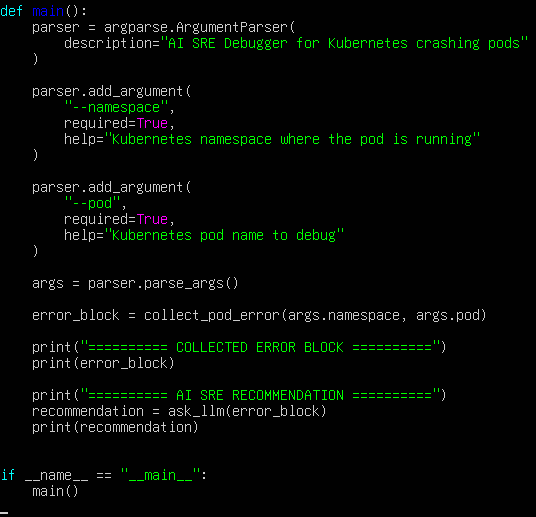
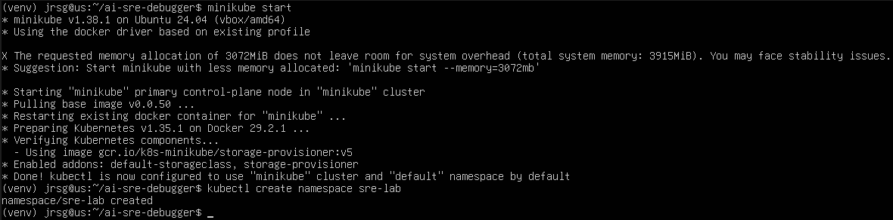
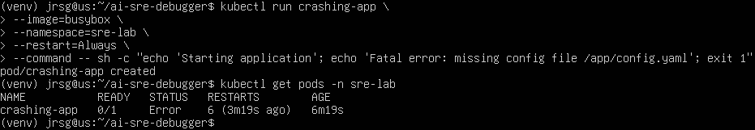
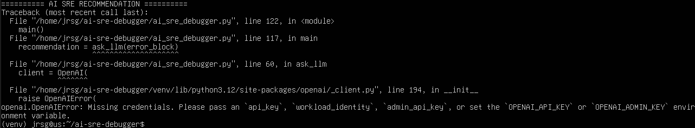

# Workflow Automation with AI

## Objective
Integrating large language models (LLMs) and intelligent agents into day-to-day operations. Moving away from manually writing scripts towards designing workflows where AI diagnoses infrastructure faults in real time.

### AI for Platform/SRE
The application of artificial intelligence to Platform Engineering and SRE improves the way teams detect, analyse and resolve incidents in complex systems. One of the most significant use cases is predictive log analysis, where AI can review large amounts of data and detect anomalous patterns before they become a serious problem. This makes it possible to anticipate failures related to CPU saturation, excessive memory consumption, 5xx errors, network issues or repetitive behaviour in certain services.

Furthermore, AI can group similar errors, prioritise the most critical ones and correlate logs, metrics and traces to help identify the root cause of an incident. This reduces the time SRE teams spend manually reviewing information and improves the mean time to resolution, known as MTTR. Another very useful application is the automatic generation of incident runbooks. Based on previous incidents, internal documentation or best practices, AI can generate guides containing diagnostic steps, recommended commands and possible solutions.

It is also particularly useful for translating complex Kubernetes errors into plain language. Errors such as `CrashLoopBackOff`, `ImagePullBackOff`, `ReadinessProbe` failures or permission issues can be explained more clearly, indicating what they mean, why they might be occurring and how to start investigating them. This makes the job easier for both junior staff and on-call teams who need to act quickly. Even so, AI should be viewed as a support tool and not as a substitute for human technical judgement, especially in production environments.

### Autonomous Infrastructure Agents
Autonomous infrastructure agents are tools capable of analysing cloud environments, running diagnostics and proposing actions automatically. Unlike a traditional chatbot, an agent can follow a sequence of steps, interpret the results obtained and decide what information it needs to consult next. Tools such as Copilot for CLI or custom agents can assist technical teams from the terminal, running diagnostic commands and summarising the results in an understandable way.

For security reasons, it is best for these agents to initially operate in read-only mode. This means they can view information, but cannot modify resources or perform dangerous actions. For example, they can check the status of pods in Kubernetes, cluster events, application logs, deployments, services, metrics, or cloud resources such as instances, load balancers, databases and IAM permissions. In this way, they can answer questions such as why a pod is not starting, which service is failing, or whether any resources are overloaded.

To carry out these diagnostics, an agent can execute commands such as `kubectl get pods`, `kubectl describe`, `kubectl logs`, or queries to the cloud provider’s APIs. Its main advantage is that it automates repetitive tasks, organises scattered information, and helps the operator understand the system’s status more quickly. However, it is essential to restrict its permissions using RBAC, minimal IAM roles, and strict access policies. It is also important to log all their actions so that they can be audited later.

In critical environments, these agents should not apply changes without human approval. Their greatest value lies in speeding up diagnostics, reducing manual work and providing a clear view of what is happening in the infrastructure. When properly configured, they can become a very useful tool for Platform and SRE teams, as they enable better decision-making without compromising the security of the environment.

### Exercise 1: Create a Python script called `ai_sre_debugger.py`.
First, you need to carry out some preliminary installation steps to be able to complete the exercise:
```
sudo apt update
sudo apt install -y python3 python3-pip python3-venv
mkdir ai-sre-debugger
cd ai-sre-debugger
python3 -m venv venv
source venv/bin/activate
pip install openai
```

Now let’s create the `ai_sre_debugger.py` script:







- **`import subprocess`:** Allows system commands to be executed from Python. In this case, it is used to run commands such as `kubectl logs` and `kubectl describe`.

- **`result = subprocess.run(command, capture_output=True, text=True)`:** Executes the specified command. `capture_output=True` captures the command’s output. `text=True` treats the output as plain text.

- **`[‘kubectl’, “logs”, pod_name, ‘-n’, namespace, ‘--tail=100’]`:** Retrieves the last 100 lines of logs from the specified Pod.

- **`[‘kubectl’, “logs”, pod_name, ‘-n’, namespace, ‘--previous’, ‘--tail=100’]`:** Retrieves logs from the previous container. This is useful when the container has already restarted after failing.

- **`[‘kubectl’, ‘describe’, “pod”, pod_name, ‘-n’, namespace]`:** Retrieves the full description of the Pod, including events, status, restarts, image errors, probes, etc.

- **`client = OpenAI(api_key=os.environ.get(‘OPENAI_API_KEY’))`:** Creates the OpenAI client using an environment variable. This way, you don’t write the API key directly into the code.

- **`instructions=system_prompt`:** Defines the model’s role. Here, it is instructed to act as a Senior SRE with expertise in Linux Internals and Kubernetes.

- **`input=user_prompt`:** Sends the error log captured with `kubectl logs` and `kubectl describe` to the model.

- **`return response.output_text`:** Returns only the text generated by the model.

### Exercise 2: The script must use `subprocess` (Week 2) to capture the error from a Kubernetes Pod in the `CrashLoopBackOff` state (using `kubectl logs` and `kubectl describe`).
First, let’s create a test namespace and a pod that crashes, called `crashing-app`:





### Exercise 3: Send that error text block as a structured prompt to an LLM API (e.g. OpenAI or Anthropic using secure environment variables). Configure the prompt system to act as a ‘Senior SRE Engineer with expertise in Linux Internals’ and return the exact 3 steps to resolve the container crash.
We run the script (`python3 ai_sre_debugger.py --namespace sre-lab --pod crashing-app`) and see the result:

